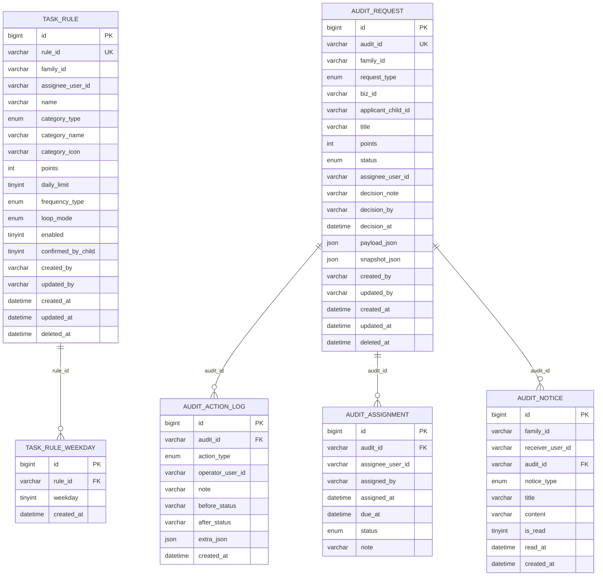
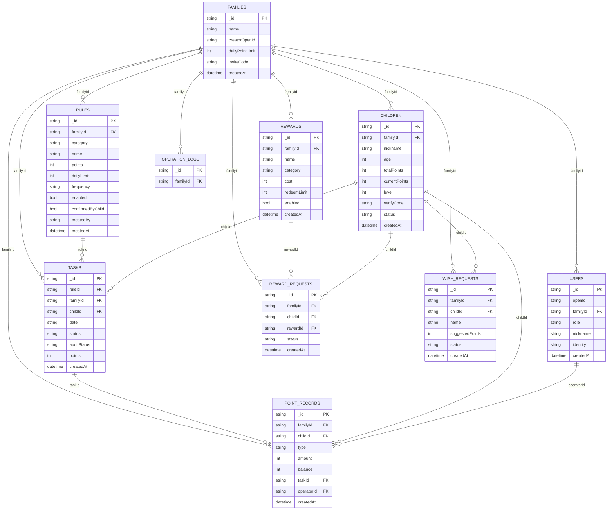

# ER 图（当前项目）

更新时间：2026-03-26

## 1) SQL 物理表 ER（`cloudfunctions/table/*.sql`）

```mermaid
erDiagram
    TASK_RULE {
        bigint id PK
        varchar rule_id UK
        varchar family_id
        varchar assignee_user_id
        varchar name
        enum category_type
        varchar category_name
        varchar category_icon
        int points
        tinyint daily_limit
        enum frequency_type
        enum loop_mode
        tinyint enabled
        tinyint confirmed_by_child
        varchar created_by
        varchar updated_by
        datetime created_at
        datetime updated_at
        datetime deleted_at
    }

    TASK_RULE_WEEKDAY {
        bigint id PK
        varchar rule_id FK
        tinyint weekday
        datetime created_at
    }

    AUDIT_REQUEST {
        bigint id PK
        varchar audit_id UK
        varchar family_id
        enum request_type
        varchar biz_id
        varchar applicant_child_id
        varchar title
        int points
        enum status
        varchar assignee_user_id
        varchar decision_note
        varchar decision_by
        datetime decision_at
        json payload_json
        json snapshot_json
        varchar created_by
        varchar updated_by
        datetime created_at
        datetime updated_at
        datetime deleted_at
    }

    AUDIT_ACTION_LOG {
        bigint id PK
        varchar audit_id FK
        enum action_type
        varchar operator_user_id
        varchar note
        varchar before_status
        varchar after_status
        json extra_json
        datetime created_at
    }

    AUDIT_ASSIGNMENT {
        bigint id PK
        varchar audit_id FK
        varchar assignee_user_id
        varchar assigned_by
        datetime assigned_at
        datetime due_at
        enum status
        varchar note
    }

    AUDIT_NOTICE {
        bigint id PK
        varchar family_id
        varchar receiver_user_id
        varchar audit_id FK
        enum notice_type
        varchar title
        varchar content
        tinyint is_read
        datetime read_at
        datetime created_at
    }

    TASK_RULE ||--o{ TASK_RULE_WEEKDAY : "rule_id"
    AUDIT_REQUEST ||--o{ AUDIT_ACTION_LOG : "audit_id"
    AUDIT_REQUEST ||--o{ AUDIT_ASSIGNMENT : "audit_id"
    AUDIT_REQUEST ||--o{ AUDIT_NOTICE : "audit_id"
```

## 2) 云集合逻辑 ER（`DESIGN.md` 第 3 节）

```mermaid
erDiagram
    FAMILIES {
        string _id PK
        string name
        string creatorOpenId
        int dailyPointLimit
        string inviteCode
        datetime createdAt
    }

    USERS {
        string _id PK
        string openId
        string familyId FK
        string role
        string nickname
        string identity
        datetime createdAt
    }

    CHILDREN {
        string _id PK
        string familyId FK
        string nickname
        int age
        int totalPoints
        int currentPoints
        int level
        string verifyCode
        string status
        datetime createdAt
    }

    RULES {
        string _id PK
        string familyId FK
        string category
        string name
        int points
        int dailyLimit
        string frequency
        bool enabled
        bool confirmedByChild
        string createdBy
        datetime createdAt
    }

    TASKS {
        string _id PK
        string ruleId FK
        string familyId FK
        string childId FK
        string date
        string status
        string auditStatus
        int points
        datetime createdAt
    }

    POINT_RECORDS {
        string _id PK
        string familyId FK
        string childId FK
        string type
        int amount
        int balance
        string taskId FK
        string operatorId FK
        datetime createdAt
    }

    REWARDS {
        string _id PK
        string familyId FK
        string name
        string category
        int cost
        int redeemLimit
        bool enabled
        datetime createdAt
    }

    REWARD_REQUESTS {
        string _id PK
        string familyId FK
        string childId FK
        string rewardId FK
        string status
        datetime createdAt
    }

    WISH_REQUESTS {
        string _id PK
        string familyId FK
        string childId FK
        string name
        int suggestedPoints
        string status
        datetime createdAt
    }

    OPERATION_LOGS {
        string _id PK
        string familyId FK
    }

    FAMILIES ||--o{ USERS : "familyId"
    FAMILIES ||--o{ CHILDREN : "familyId"
    FAMILIES ||--o{ RULES : "familyId"
    FAMILIES ||--o{ TASKS : "familyId"
    FAMILIES ||--o{ POINT_RECORDS : "familyId"
    FAMILIES ||--o{ REWARDS : "familyId"
    FAMILIES ||--o{ REWARD_REQUESTS : "familyId"
    FAMILIES ||--o{ WISH_REQUESTS : "familyId"
    FAMILIES ||--o{ OPERATION_LOGS : "familyId"

    RULES ||--o{ TASKS : "ruleId"
    CHILDREN ||--o{ TASKS : "childId"
    TASKS ||--o{ POINT_RECORDS : "taskId"
    CHILDREN ||--o{ POINT_RECORDS : "childId"
    USERS ||--o{ POINT_RECORDS : "operatorId"
    REWARDS ||--o{ REWARD_REQUESTS : "rewardId"
    CHILDREN ||--o{ REWARD_REQUESTS : "childId"
    CHILDREN ||--o{ WISH_REQUESTS : "childId"
```

